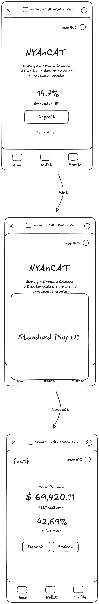

# NYAnCAT – Neutral Yield AggregatioNal Compounding Algorithmic Treasury

See it [live here as a World App Mini App](https://worldcoin.org/mini-app?app_id=app_77eeb2e53649726aa2eba216ae6967e3&draft_id=meta_e350958dfef2e040f0c64f823e2d5434).



NYAnCAT is a playful delta-neutral yield aggregator built as a **World App Mini App**. It lets Worldcoin users seamlessly deposit **USDC**, mint **vyShares**, and earn compounding yield powered by AI-optimised, delta-neutral strategies – all without ever leaving the World App.

> "Earn yield from advanced AI delta-neutral strategies throughout crypto." – The Cat 🐱🌈

---

## ✨ Key Features

• **One-tap Wallet Auth** – Login with World App's embedded wallet auth (powered by *minikit-js* & *next-auth*).  
• **Deposit / Mint Flow** – Swap USDC for `vyShares` via a standard Pay UI and mint on-chain.  
• **Real-time Balance & APY** – Watch your balance grow in real time as strategies compound.  
• **Delta-neutral Strategies** – Simulated back-test showing 14.7 % APY and 42.69 % YTD.  
• **Retro Pixel Aesthetics** – Press Start 2P font, Nyan Cat sprite, and brand colours `#0056A5` / `#F5F5F5` / `#FF90C2`.

---

## 🏗️ Tech Stack

| Layer            | What we use                                                    |
| ---------------- | -------------------------------------------------------------- |
| Framework        | [Next.js](https://nextjs.org/) 14 (App Router, Server Actions) |
| Styling          | [Mini Apps UI Kit](https://github.com/worldcoin/mini-apps-ui-kit) + Tailwind CSS |
| Auth & Sessions  | [Worldcoin minikit-js](https://github.com/worldcoin/minikit-js) + [next-auth](https://authjs.dev/) |
| Blockchain       | [ethers.js](https://docs.ethers.org/) – interacts with mock vault contracts in `src/abi` |
| Tooling          | TypeScript, ESLint, Prettier                                    |

---

## 📂 Important Folders

```
src/
  app/           # Next.js route handlers & pages
  components/    # Reusable UI components (DepositButton, MintButton, …)
  auth/          # Worldcoin wallet auth helpers
  abi/           # Mock vault smart-contract ABIs
  providers/     # Context providers (Eruda, etc.)
```

---